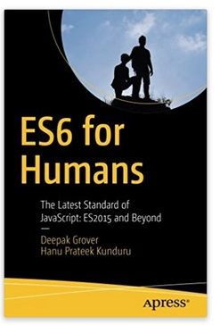

### 【ES2015 and Beyond】00-书籍简介(翻译)

书名：ES6 for Humans: The Latest Standard of JavaScript: ES2015 and Beyond

[完整目录](ES6-for-humans.md)

译者：魔芋

[亚马逊购买地址](https://www.amazon.cn/dp/1484226224/ref=sr_1_1?s=digital-text&ie=UTF8&qid=1528516616&sr=8-1&keywords=ES6+for+human)

出版日期：2017-08

作者：Deepak Grover、 Hanu Prateek Kunduru 

---

目录：

1. Getting Started with ES6
2. New Syntax in ES6
3. Destructuring
4. Classes in ES6
5. Modules
6. Symbols
7. Arrays and Collections
8. Iterators and Generators
9. Promises In ES6
10. Meta Programming
11. Beyond ES2016

---

author:

Deepak Grover是一位来自印度的软件架构师，他一直在帮助几家初创公司成长和构建可伸缩的产品。 他拥有软件工程硕士学位，在过去的八年里一直在编程。 他精通JavaScript并使用ES6、React JS和Angular 2构建了几个开源库。 除了电脑，他喜欢旅行，而且经常在技术会议上谈论JavaScript。 

hanu Kunduru是一位精通多种计算机语言的高手，广泛使用C、C、Java、Python、Ruby和JavaScript。 他是一位有经验的企业家，有经验的建设和扩展技术和网络产品。 他以前是一家科技初创公司的首席技术官，有管理大型开发团队和工作流的经验。 他目前在加州硅谷42号工作，这是一所编程学校，拥有一个革命性的基于项目的、点对点的学习环境。 

Phil Nash 是Twilio公司的开发人员，为伦敦和世界各地的开发者社区服务。 他是一个Ruby，JavaScript和swift开发人员，谷歌开发专家，博客作者，演讲者，偶尔也是个酿酒师。 他经常在会议和会议上出没，玩新技术和新API，或者写开源代码。 