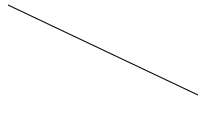

# cavans 学习记录 By 魔芋


### 【Q】canvas是什么？

类似于画布，可以在网页上绘制图形图像。它是图形的容器。

### 【Q】如何使用canvas?

通过JS


### 【Q】canvas有哪些注意事项？

01，画布是一个矩形区域，可以控制其每一像素。

02，canvas本身没有绘制能力。

03，是依赖分辨率的位图。（bitmap canvas）

04，可以绘制任意图形。

05，可以加载图片。

06，画布元素和它的上下文对象是两个完全不同的对象。

07，它是一个矩形，而且只能是一个矩形。就是不能圆。


### 【Q】如何绘制一个canvas图形？请给出一个实例。

在HTML中，

​	<canvas id="moyu"></canvas>

在JS代码中：

```
	var ctx = document.getElementById("moyu").getContext(“2d”);//返回一个绘图对象。
	cxt.fillStyle("red");
```


### 【Q】Canvas是不是透明的？

Canvas是没有背景色的，也就是说Canvas默认是完全透明的，就像一块玻璃。

### 【Q】Canvas可不可以互相堆叠在一起？

Canvas在浏览器中纳入了DOM体系，是可以通过CSS 的Position和z-index值来操作任意多个Canvas堆叠在一起，合成效果就像操作div标签一样。

### 【Q】canvas的默认大小是？

默认情况下，即使在html中没有定义大小，浏览器默认创建一个宽300像素和高150像素的canvas元素。

### 【Q】canvas的元素尺寸和绘图尺寸的区别？

设置canvas元素本身的width和height属性，同时设置了元素的尺寸和元素绘图面积的尺寸

当用CSS来设置宽高时，仅仅设置了元素的尺寸，而不是绘图面积的尺寸。

不同点：当canvas元素的尺寸和绘图面积的尺寸不一样的时候，浏览器会缩放绘图面积来符合元素的尺寸。

正是这个原因，需要使用元素的 `width` 和 `height` 属性来设置元素尺寸，而不是用CSS。


### 【Q】canvas的用途是？

**1. 游戏：**
**2. 图表制作：**
**3. banner广告：**
**4. 模拟器：**
**5. 远程计算机控制：**Canvas可以让开发者更好地实现基于Web的数据传输，构建一个完美的可视化控制界面。
**6. 字体设计**：
**7. 图形编辑器：**
**8. 其他可嵌入网站的内容：**类似图表、音频、视频，还有许多元素能够更好地与Web融合，并且不需要任何插件。


### 【魔芋】术语解释：

2D上下文，又叫做“绘制上下文”对象、2D绘图上下文。

获取该对象可以通过调用画布元素的getContext()方法。

调用getContext()方法时，传递一个“2d”参数，会获得一个CanvasRenderingContext2D对象（简称为“上下文对象”），使用该对象可以在画布上绘制二维图形。

“画布API”指的也就是CanvasRenderingContext2D对象的方法。


### 【Q】canvas的坐标系统是什么样的？

坐标开始于`<canvas>`元素的左上角，原点坐标是(0,0)。

所有坐标值都基于这个原点计算，x值越大表示越靠右，y值越大表示越靠下。

默认情况下，canvas的`width`和`height`表示水平和垂直两个方向上可用的像素数目。


### 【Q】canvas的兼容性？

**Internet Explorer 9**、Firefox、Opera、Chrome 以及 Safari 支持 。


### 【Q】检测浏览器是否支持Canvas？

两种检测方法。推荐使用第二种方法，结合标签自身的能力作出简洁有效的判断。

 通过原生JavaScript

```
if(!document.createElement('canvas').getContext){
    //如果不能建立canvas元素，则执行此处的代码
}
```
 直接使用canvas标签来判断

```
<canvas>你的浏览器不支持Canvas</canvas>
```

而如果你的浏览器不支持Canvas API，则浏览器将显示“你的浏览器不支持Canvas”，而不解释<canvas></canvas>标签。


### 【Q】canvas有哪些优点？

01，性能好。

todo：魔芋：判断的标准是？

02，兼容性好。主流浏览器都支持。

03，Canvas区域中的每一个像素都可控，即所谓的像素级操作。

04，Canvas不需要插件，具有跨平台的先天优势。


### 【Q】如何使用Canvas和HTML5中的SVG去画一个矩形？

HTML5使用SVG绘制矩形的代码

```
<svg xmlns="http://www.w3.org/2000/svg" version="1.1">
<rect style="fill: rgb(0, 0, 255); stroke-width: 1px; stroke: rgb(0, 0, 0);" height="[object SVGAnimatedLength]" width="[object SVGAnimatedLength]">
</rect>
```

HTML5使用Canvas绘制矩形的代码

```
var c=document.getElementById("mycanvas");
var ctx=c.getContext("2d");
ctx.rect(20,20,150,100);
ctx.stroke();
```


### 【Q】Canvas和SVG图形的区别是什么？

面试官想知道你在什么时候选用哪种方式。

| SVG                                                          | Canvas                                                     |
| ------------------------------------------------------------ | ---------------------------------------------------------- |
| 这个就好像绘制和记忆，换句话说任何使用SVG绘制的形状都能被记忆和操作，浏览器可以再次显示 | Canvas就像绘制和忘记，一旦绘制完成你不能访问像素和操作它   |
| SVG对于创建图形例如CAD软件是良好的，一旦东西绘制，用户就想去操作它 | Canvas在绘制和忘却的场景例如动画和游戏是良好的             |
| 因为为了之后的操作，需要记录坐标，所以比较缓慢               | 因为没有记住以后事情的意向，所以更快                       |
| 我们可以用绘制对象的相关事件处理                             | 我们不能使用绘制对象的相关事件处理，因为我们没有他们的参考 |
| 分辨率无关                                                   | 分辨率相关                                                 |


【Q】如何使用Canvas来画一条简单的线？

```
<body  onload="DrawMe();">
<canvas id="mycanvas" width="600" height="500" style="border:1px solid #000000;"></canvas>
</body>
<script>
function DrawMe()
{
var c=document.getElementById("mycanvas");
var ctx=c.getContext("2d");
ctx.moveTo(10,10);
ctx.lineTo(200,100);
ctx.stroke();
}
```

你可以得到以下输出


 


---


**