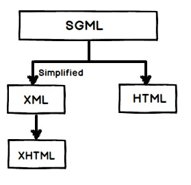

### 【29】SGML（标准通用标记语言）和HTML（超文本标记语言），XML（可扩展标记语言）和HTML的之间有什么关系？

SGML（标准通用标记语言）是一个标准，告诉我们怎么去指定文档标记。它只是描述文档标记应该是怎么样的元语言，HTML是被用SGML描述的标记语言。

因此利用SGML创建了HTML参照和必须共同遵守的DTD，你会经常在HTML页面的头部发现“DOCTYPE”属性，用来定义用于解析目标DTD

```
<!DOCTYPE html PUBLIC "-//W3C//DTD HTML 4.01//EN" "http://www.w3.org/TR/html4/strict.dtd">
```

现在解析SGML是一件痛苦的事情，所以创建了XML使事情更好。XML使用了SGML，例如：在SGML中你必须使用起始和结束标签，但是在XML你可以有自动关闭的结束标签。

XHTML创建于XML，他被使用在HTML4.0中。

你可以参考下面代码片段中展示的XML DTD

```
<!DOCTYPE html PUBLIC "-//W3C//DTD XHTML 1.0 Transitional//EN" "http://www.w3.org/TR/xhtml1/DTD/xhtml1-transitional.dtd">
```



总之，SGML是所有类型的父类，较旧的HTML利用SGML，HTML4.0使用派生自XML的XHTML

 