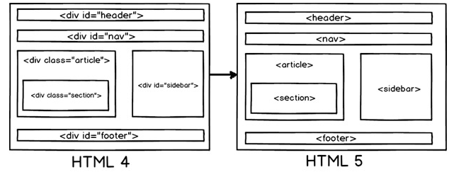

### HTML5的页面结构同HTML4或者更前的HTML有什么区别？

一个典型的WEB页面包含头部，脚部，导航，中心区域，侧边栏。

现在如果我们想在在HTML4的HTML区域中呈现这些内容，我们可能要使用DIV标签。

但是在HTML5中通过为这些区域创建元素名称使他们更加清晰，也使得你的HTML更加可读

以下是形成页面结构的HTML5元素的更多细节：

- <header>：代表HTML的头部数据
- <footer>：页面的脚部区域
- <nav>：页面导航元素
- <article>：自包含的内容
- <section>：使用内部article去定义区域或者把分组内容放到区域里
- <aside>：代表页面的侧边栏内容

 