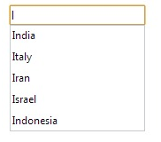

【35】HTML5中的datalist是什么？

HTML5中的Datalist元素有助于提供文本框自动完成，如下图所示：



以下是DataList功能的HTML代码：

```
<input list="Country">
<datalist id="Country">
  <option value="India">
  <option value="Italy">
  <option value="Iran">
  <option value="Israel">
  <option value="Indonesia">
</datalist>
```

魔芋：IE和safari不支持。

 