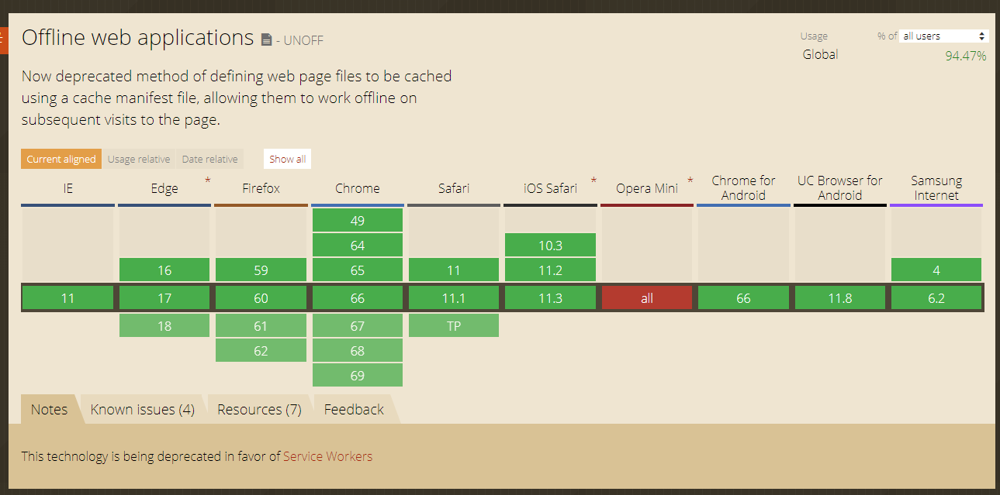

# 应用缓存篇


### catalog：


- [应用缓存中的网络是什么？ ](#应用缓存中的网络是什么)
- [HTML5中的应用缓存是什么？ ](#HTML5中的应用缓存是什么)
- [规范地址？](#规范地址)
- [兼容性？](#兼容性)
- [如何检验是否支持应用缓存？](#如何检验是否支持应用缓存)


---


### context：

### HTML5中的应用缓存是什么？ 

实现用户的离线浏览，当网络连接不可用时，页面应该来自浏览器缓存，离线应用缓存可以达到这个目的。
应用缓存可以帮助指定哪些文件需要缓存，哪些不需要。

 


### 应用缓存中的网络是什么？

网络命令描述中不需要被缓存或离线访问的文件，例如：

```
NETWORK:
home.html
```

 


### 规范地址？


离线Web 应用的完整规范，请见如下网址：

<http://w3c.github.io/html/#offline>


### 兼容性？

所有主流浏览器都支持应用程序缓存，IE10和IE10+支持。




### 如何检验是否支持应用缓存？ 

```
if(window.applicationCache){
    //浏览器支持离线应用，在此编写离线应用功能
}
```


