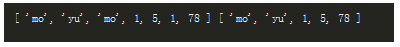

01，数组去重。

将数组里面重复的元素去掉。

var arr = ["mo","yu","mo"];

变为

arr = ["mo","yu"];

02，要求：

一个函数，输入原数组，返回新数组。原数组不变。


---


###### 03，利用indexOf

思路：在新数组里是否已经存在了。

```
let arr = ["mo","yu","mo",1,5,1,78];

function unique(arr){
    let brr =[],len=arr.length;
    


for(let i=0;i<len;i++){
    if(brr.indexOf(arr[i])== -1){
        //魔芋:在brr中没有找到，就插入brr中。
        brr.push(arr[i]);
    }
}
return brr;


}

console.log(arr,unique(arr));
```




复杂度为o(n);//我猜测的。


04，利用对象的键值对。已存在的属性值设置为true。

```
function unique(arr){
    let brr =[],len=arr.length;


let obj = {};
for(let i=0;i<len;i++){
    if(!obj[arr[i]]){
        /*
        * 魔芋:将数组元素作为obj对象的属性。然后设置该属性值为true。
        * 通过给对象属性值，取反，跳过插入新数组的操作。
        * */
        obj[arr[i]]=true;
        brr.push(arr[i]);
    }
   
}
return brr;


}
```

魔芋：问题，无法区分1和“1”;

修改如下：

```
unction unique(arr) {
  var ret = []
  var hash = {}
  for (var i = 0; i < arr.length; i++) {
    var item = arr[i]
    var key = typeof(item) + item;
    if (hash[key] !== 1) {
      ret.push(item)
      hash[key] = 1
    }
  }
  return ret;
}
```

对下面这种输入就无法判断：

```
unique([ new String(1), new Number(1) ])
```

05，原数组的indexOf()并不和i相等。

```
function unique(arr){
    let brr =[],len=arr.length;

 
        if(arr.indexOf(arr[i])== i){

            //魔芋:如果在原数组存在过，那么它的indexOf并不等于i;

            brr.push(arr[i]);
        }
    }


    return brr;
}
```

06，先把数组排序，然后重复的元素必定相邻。然后重复的项跳过。

```
function unique(arr){
    let brr =[],len=arr.length;

    arr.sort();
    
    brr.push(arr[0]);

    for(let i=0;i<len;i++){
        if(brr[i]!== arr[i+1]){
            
            brr.push(arr[i]);
        }
    }
    
    return brr;
}
```

07，双层for循环。让原数组的每个元素与原数组对比。如果存在就删除。复杂度为o(n^2)

```
function unique(arr){
    
    for(let i=0;i<arr.length;i++){
       for(let j =i+1;j<arr.length;j++){
           if(arr[i]===arr[j]){
               arr.splice(j,1);
           }
       }
    }
    
    return arr;
}
```

08，用ES6方法

```
 // 返回去重后的数组
 const numbers = [1, 2, 1, 1, 2, 1, 3, 4, 1 ];
 const uniq = [...new Set(numbers)] //  [ 1, 2, 3, 4 ];
 const uniq2 = Array.from(new Set(numbers)) // [ 1, 2, 3, 4 ];
```