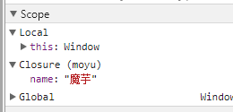

# 闭包之魔芋理解


### 【魔芋】概念解释：

01，在一个函数内声明一个函数，形成了嵌套函数。此时，外边的函数称为外部函数。内部的称为内部函数。或称为父函数和子函数。


02，闭包wiki:<https://en.wikipedia.org/wiki/Closure_%28computer_programming>

 

03，JS采用词法作用域（lexical scoping），函数的执行依赖于函数作用域，这个作用域是在函数定义时决定的，而不是函数调用时决定的。

- 词法作用域：词法作用域也叫静态作用域，是指作用域在词法解析阶段就已经确定了，不会改变。
- 动态作用域：是指作用域在运行时才能确定。


参看下面的例子，引自[杨志的回答](https://www.zhihu.com/question/20032419/answer/13742892)

```
var foo=1;

function static(){
    alert(foo);
}

!function(){
    var foo=2;
    static();

}();
```

在js中，会弹出1而非2，因为static的scope在创建时，记录的foo是1。
如果js是动态作用域，那么他应该弹出2


04，魔芋：识别闭包，在词法分析阶段已经确定了。

当外部函数运行的时候，一个闭包就形成了，他由内部函数的代码以及任何内部函数中指向外部函数局部变量的引用组成。


---


###  【Q】函数第一次被调用时，会发生什么？ 

当函数第一次被调用时，会创建一个执行环境（execution context）及相应的作用域链，并把作用域链赋值给一个特殊的内部属性（即`[[Scope]]`）。

然后，使用`this`、`arguments`和其他参数来初始化函数的活动对象（activation object）。

在作用域链中，内部函数的活动对象出于第一位，外部函数的活动对象始终处于第二位，外部函数的外部函数的活动对象处于第三位，……直至作为作用域链终点的全局执行环境。

每次调用JS函数时，会为之创建一个新的对象来保存所有的局部变量（函数定义的变量，函数参数。），把这个对象添加到作用域链中。函数体内部的变量都保存在函数作用域内。

我们将作用域链看做一个对象列表，而不是一个栈。（魔芋：栈是一种线性表，仅允许在表的一端进行插入和删除运算。）

当函数返回的时候，就从作用域链中将这个绑定变量的对象删除。

如果这个函数不存在嵌套的函数，也没有其他引用指向这个绑定变量的对象，它就会被当做垃圾回收掉（魔芋：这个操作由浏览器自动完成）。


### 【Q】闭包是什么？

闭包（closure）是可以访问外部函数作用域中的变量的函数。（外部函数的参数也可以访问）


###  【Q】为什么闭包函数可以访问外部函数的变量？

因为闭包函数的作用域链包含了外部函数的作用域。

 

### 【Q】如何创建闭包？

在一个函数类内创建另外一个函数。内部函数使用了外部函数的变量，就形成了闭包。


###  【Q】普通函数的内部函数是闭包函数么？

魔芋：不是。


### 【Q】闭包函数必须返回（return）么，return这个闭包函数？

魔芋：不必要返回，只要使用外部函数的变量即可。

代码：

```
function fn1() {
    var a = 1;
    


function fn2() {
    console.log(a);
}

fn2();


}

fn1();
```


### 【Q】 如果用不同的变量引用函数中的闭包函数。 它们是相同的么？

是不同的。

简单的例子：

```
function outter(){
    var x = 0;
    return function(){
        return x++;
    }
}
var a = outter();
console.log(a());
console.log(a());
var b = outter();
console.log(b());
console.log(b());
```


运行结果为：
0
1
0
1


### 【Q】闭包的用途？

- 可以创建私有变量。

因为只有闭包函数可以访问外部函数的变量。


### 【Q】请写出一个闭包实例？

```
function moyu(){
    var name = "魔芋";
    return function(){
        console.log(name+" 你好~");
}
}
var res = moyu();
res();//"魔芋 你好~"
```





### 【Q】闭包的缺点：

- 闭包函数作用域中，使用的外部函数变量不会被立刻销毁回收，所以会占用更多的内存。过度使用闭包会导致性能下降。建议在非常有必要的时候才使用闭包。 


---

### 魔芋归纳的一些注意点：

01，同一个闭包函数，所访问的外部函数的变量是同一个变量。 

02，如果把闭包函数，赋值给不同的变量，那么不同的变量指向的是不同的闭包函数，所使用的外部函数变量是不同的。 

03，闭包函数分为定义时，和运行时。只有运行时，才会访问外部函数的变量。 

04，在for循环的闭包函数，只有在运行时，才在作用域中寻找变量。for循环会先运行完毕，此时，闭包函数并没有运行。 

例子：如果闭包中使用for的i。那么闭包中的i是for循环中的最后一个值。

05，如果在for循环中，使用闭包的自执行函数。那么闭包会使用for循环的变量i（0-*，假设i从0开始）。 

06，一个函数里，可以有多个闭包。 


### 【Q】闭包和内存泄漏？

在IE中，JS对象和DOM对象使用不同的垃圾收集机制。

事件绑定中的匿名函数也是闭包函数。

如果闭包函数中有HTML元素。那么该元素由于有引用，所以无法被回收。

```
function moyu_test(){

var  _div = document.getElementById("moyu");

_div.onclick=function(){

	console.log(_div.innerHTML);

}

}

moyu_test();//这里_div元素有引用，除非浏览器关闭才会回收。


```

改进方式：主动解除引用。


```
function moyu_test(){

var  _div = document.getElementById("moyu");

_div.onclick=function(){

	console.log(_div.innerHTML);

}

_div=null;//解除引用

}

moyu_test();


```


