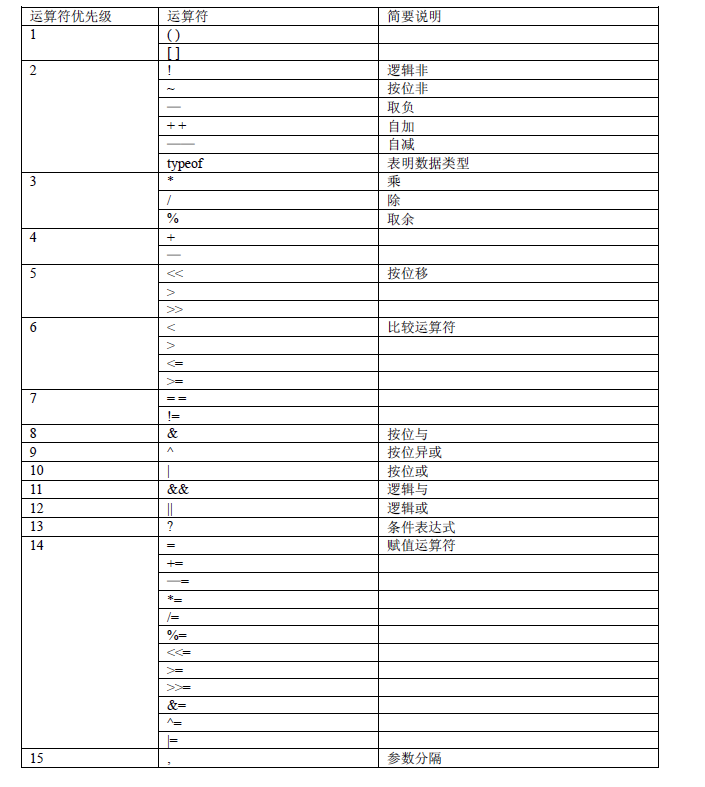

# 操作符的相关问题 by 魔芋

#### 【魔芋】名词解释：

运算符，又称为操作符。比如：+-&%

操作数比如3,true。

### 【Q】是否所有的操作符都可以运用在任何操作数呢？

并不是，比如除号的被除数不能为0。

### 【Q】运算符的优先级是？

### 【Q】操作符的分类是？

- 根据操作数的个数不同，可以分为一元操作符，二元操作符，三元操作符（？：）

### 【Q】如何在对象上使用操作符？

操作符应用于对象时，操作符会调用对象的valueOf()或toString()，以便取得可以操作的值。

### 【Q】运算符的运算顺序是？

魔芋：通常是从左到右的顺序。比如加减乘除。

但是，一元、赋值、三元运算符都是从右到左的顺序。

比如：

moyu=mo=yu=1;//等价于moyu=(mo=(yu=1));

### 【Q】运算符有哪些？注意事项是什么？

**比较运算符：**

==、===、！=、！==、\>、\>=、<、<=

**逻辑运算符：**

&&，||，!

**赋值运算符：**

=，*=，/=,%=,+=,-=,<<=,>>=,>>>=

**算术运算符：**

+，-，*，/，%,++,--

### 【Q】位操作符？

魔芋：这个用的不多，用到再深入研究。

简单的来说，有&，|，~，^，<< ,>>6种运算符。

### 【Q】var num = (3,4,3,2,11);

num是11。

逗号运算符，返回表达式的最后一项。

### 【Q】typeof 操作符？

 对变量或值调用 typeof 运算符将返回下列值之一： 

【】Undefined类型：

undefined

【】Boolean类型：

boolean

【】Number类型（包括NaN）

number

【】String类型：

string

【】Object、Null、Array（包括空数组）、Date、正则。

object

【】Function类型

function

【】任意宿主对象（魔芋：例如DOM对象。）

返回：由编译器各自实现的字符串，但不是"undefined"、"boolean"、"number"或"string"

 

### 【Q】为什么 typeof 运算符对于 null 值会返回 "Object"？

这实际上是 JS最初实现中的一个错误，然后被 ES沿用了。现在，null 被认为是对象的占位符，从而解释了这一矛盾，但从技术上来说，它仍然是原始值。

/WizNote/My%20Knowledge/temp/66cc803e-03b8-48e6-b410-9a390488da21/128/index_files/2dffb2a4-e01b-4d1f-8dcc-63e885ce6cb4.png)

### 【Q】各种等式判断

null ==undefined ;//true

null===undefined;//false