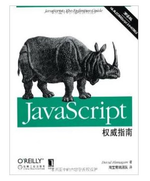

# 阅读书籍归档

### catalog：

- 《JavaScript高级程序设计》（第3版）

  > 推荐：:star::star::star::star::star:

- 《JavaScript权威指南（第6版）》 

  > 推荐：:star::star::star::star::star:

---

### Context:

### 《JavaScript高级程序设计》（第3版）

源代码下载网址：<http://www.ituring.com.cn/book/946>

 

[美] Nicholas C.Zakas 著

李松峰 曹力 译

2012年3月出版

 

---

### 《JavaScript权威指南（第6版）》 

David Flanagan著 淘宝前端团队译 

2012年出版。

共1018页；

外文书名: JavaScript:The Definitive Guide,Sixth Edition

 实例代码下载地址：<http://oreilly.com/catalog/9780596805531> 

[ 亚马逊地址：](https://www.amazon.cn/O-Reilly%E7%B2%BE%E5%93%81%E5%9B%BE%E4%B9%A6%E7%B3%BB%E5%88%97-JavaScript%E6%9D%83%E5%A8%81%E6%8C%87%E5%8D%97-%E5%BC%97%E5%85%B0%E7%BA%B3%E6%A0%B9/dp/B007VISQ1Y/ref=sr_1_1?s=books&ie=UTF8&qid=1476254490&sr=1-1&keywords=JavaScript%E6%9D%83%E5%A8%81%E6%8C%87%E5%8D%97%EF%BC%88%E7%AC%AC6%E7%89%88%EF%BC%89) 

