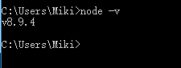

- # node学习记录 BY 魔芋

- ### node学习网址

- [node官网](https://nodejs.org)

- [安装包下载地址](https://nodejs.org/en/)

- [[Node.js ES2015 Support](http://node.green/#ES2015)](http://node.green/)

> 魔芋：这是一个NODE对ES6支持情况的表格

---

- ### node安装方式有哪几种？

- 通过安装包安装

- 通过源码编译安装

- ### 如何判断是否安装成功了？

- 在cmd.exe中输入npm -v

- 返回版本号即可。

- ### 如何卸载node

在已安装的情况下，双击node的安装程序。会出现卸载选项。

- ### 如何在电脑的环境变量里添加node？

电脑右键-高级系统设置-环境变量-系统变量-Path。新建。添加node的安装路径。

