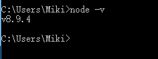

# node学习记录 BY 魔芋

- ### node学习网址

- [node官网](https://nodejs.org)

- [node安装包下载地址](https://nodejs.org/en/)


- [Node.js ES2015 Support](http://node.green/#ES2015)

  > 魔芋：这是一个NODE对ES6支持情况的表格

- [npm下载地址](https://www.npmjs.com/)

- [npm文档地址](https://docs.npmjs.com/)

- [node中文网](http://nodejs.cn/)


# 历史

### Q：node的诞生日期是？

2009年。


### Q：node是开源的么？

是的。

### Q：node最初是谁发起的？

Ryan Dahl 

### Q：window是什么时候能使用node？

2011年6月


---

# npm

### 如何安装npm?

node.js 安装后，等于npm也安装好了。


### npm是什么？

NPM（node package manager）。

通常称为node包管理器。

一个node包的管理和分发工具。（其中，包又称为模块）


### npm能做什么？

可以对模块进行管理：

- 安装
- 卸载
- 更新
- 查看
- 搜索
- 发布

### npm的实质是什么？

npm的背后，是基于couchdb的一个数据库，记录了每个包的信息，包括作者、版本、依赖、授权信息等。

### npm的作用是？

将开发者从包管理工作（版本、依赖等）中解放出来，更加专注于功能的开发。

### npm的安装、卸载、升级、配置？

### npm包的安装模式？

本地 vs 全局

### package.json：包描述信息？

### npm使用场景有以下几种：

- 允许用户从NPM服务器下载别人编写的第三方包到本地使用。
- 允许用户从NPM服务器下载并安装别人编写的命令行程序到本地使用。
- 允许用户将自己编写的包或命令行程序上传到NPM服务器供别人使用。

### 如何判断npm安装成功？

通过输入 **"npm -v"** 来测试是否成功安装。

命令如下，出现版本提示表示安装成功:

```
npm -v
2.3.0
```


---

### node安装方式有哪几种？

- 通过安装包安装

- 通过源码编译安装


### 如何判断是否安装成功了？

- 在cmd.exe中输入npm -v

- 返回版本号即可。




### 如何卸载node?

在已安装的情况下，双击node的安装程序。会出现卸载选项。


### 如何在电脑的环境变量里添加node？

电脑右键-高级系统设置-环境变量-系统变量-Path。新建。添加node的安装路径。


---


Q：请创建第一个Node.js程序：hello world

脚本模式

创建文件 helloworld.js，并通过 node命令来执行：

程序执行后，就会在终端输出 Hello World。


```
console.log("Hello World");
node helloworld.js
```

魔芋：测试结果：


另一种输出  Hello World 的方式：

可以把要执行的语句作为  node -e 的参数直接执行。

```
node -e "console.log('Hello World');"
```


### Q：如何获取到node的帮助信息？

  输入 node -help 


 

```
C:\Users\Miki>node -h
Usage: node [options] [ -e script | script.js | - ] [arguments]
       node inspect script.js [arguments]

Options:
  -v, --version              print Node.js version
  -e, --eval script          evaluate script
  -p, --print                evaluate script and print result
  -c, --check                syntax check script without executing
  -i, --interactive          always enter the REPL even if stdin
                             does not appear to be a terminal
  -r, --require              module to preload (option can be repeated)
  -                          script read from stdin (default; interactive mode if a tty)
  --inspect[=[host:]port]    activate inspector on host:port
                             (default: 127.0.0.1:9229)
  --inspect-brk[=[host:]port]
                             activate inspector on host:port
                             and break at start of user script
  --inspect-port=[host:]port
                             set host:port for inspector
  --no-deprecation           silence deprecation warnings
  --trace-deprecation        show stack traces on deprecations
  --throw-deprecation        throw an exception on deprecations
  --pending-deprecation      emit pending deprecation warnings
  --no-warnings              silence all process warnings
  --napi-modules             load N-API modules (no-op - option
                             kept for compatibility)
  --abort-on-uncaught-exception
                             aborting instead of exiting causes a
                             core file to be generated for analysis
  --trace-warnings           show stack traces on process warnings
  --redirect-warnings=file
                             write warnings to file instead of
                             stderr
  --trace-sync-io            show stack trace when use of sync IO
                             is detected after the first tick
  --force-async-hooks-checks
                             enables checks for async_hooks
  --trace-events-enabled     track trace events
  --trace-event-categories   comma separated list of trace event
                             categories to record
  --track-heap-objects       track heap object allocations for heap snapshots
  --prof-process             process v8 profiler output generated
                             using --prof
  --zero-fill-buffers        automatically zero-fill all newly allocated
                             Buffer and SlowBuffer instances
  --v8-options               print v8 command line options
  --v8-pool-size=num         set v8's thread pool size
  --tls-cipher-list=val      use an alternative default TLS cipher list
  --use-bundled-ca           use bundled CA store (default)
  --use-openssl-ca           use OpenSSL's default CA store
  --openssl-config=file      load OpenSSL configuration from the
                             specified file (overrides
                             OPENSSL_CONF)
  --icu-data-dir=dir         set ICU data load path to dir
                             (overrides NODE_ICU_DATA)
  --preserve-symlinks        preserve symbolic links when resolving
  --experimental-modules     experimental ES Module support
                             and caching modules

Environment variables:
NODE_DEBUG                   ','-separated list of core modules
                             that should print debug information
NODE_DISABLE_COLORS          set to 1 to disable colors in the REPL
NODE_EXTRA_CA_CERTS          path to additional CA certificates
                             file
NODE_ICU_DATA                data path for ICU (Intl object) data
NODE_NO_WARNINGS             set to 1 to silence process warnings
NODE_NO_HTTP2                set to 1 to suppress the http2 module
NODE_OPTIONS                 set CLI options in the environment
                             via a space-separated list
NODE_PATH                    ';'-separated list of directories
                             prefixed to the module search path
NODE_PENDING_DEPRECATION     set to 1 to emit pending deprecation
                             warnings
NODE_REPL_HISTORY            path to the persistent REPL history
                             file
NODE_REDIRECT_WARNINGS       write warnings to path instead of
                             stderr
OPENSSL_CONF                 load OpenSSL configuration from file

Documentation can be found at https://nodejs.org/

C:\Users\Miki>
```


Q：node的使用方式？

- 一个是命令行接口交互模式（CLI），输入node，回车，进入。
- 一种是执行JavaScript脚本文件来启动Node，输入 node filename，回车即可。

